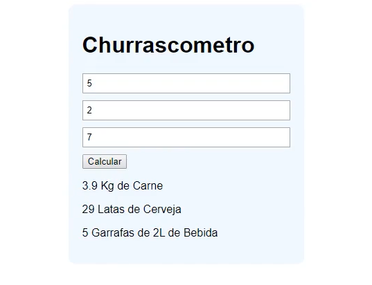
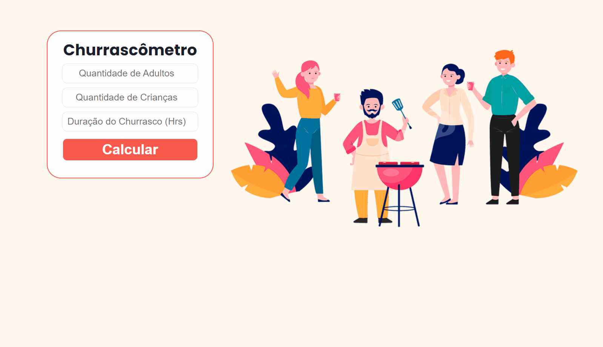

# README

<h1 align="center">Churrascômetro !</h1>

<h3 align="justify">Esse projeto foi uma proposta do curso Programador BR para colocar em prática conhecimentos de Javascript. 
                    Inicialmente a proposta passada para o projeto era bem simples, basicamente para fazer as funções e a lógica do App.</h3>
    <h3 align="center">
        
    </h3>

<h3 align="center">Decidi então dar um toque a mais ao meu gosto no projeto até chegar neste resultado:</h3>
    <h3 align="center">
        
    </h3>

### Tecnologias

<h3 align="left">As seguintes tecnologias foram utilizadas na construção do projeto:</h3>

- [HTML](https://developer.mozilla.org/pt-BR/docs/Glossary/HTML)
- [CSS](https://developer.mozilla.org/pt-BR/docs/Web/CSS)
- [Javascript](https://developer.mozilla.org/pt-BR/docs/Web/JavaScript)

---

<h3 align="left">Que tal você testar esse Projeto?</h3>

- [Clique Aqui para Testar!](https://aleffreitas.github.io/Churrascometro/)

---

Made with ❤️ by Alef Freitas 👋 [See my Linkedin](https://br.linkedin.com/in/aleffreitas)
